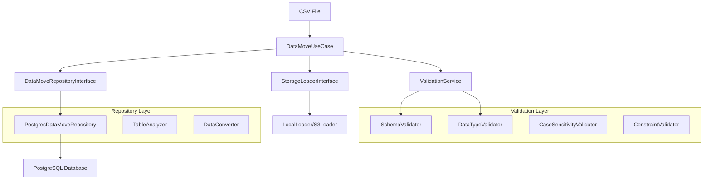

# DataMove Use Case Design Document

## Overview

The DataMove use case is a production-grade data migration tool designed specifically for moving data from CSV files to PostgreSQL databases. It provides robust validation, error handling, and schema management capabilities while maintaining compatibility with the existing vector-dataloader architecture.

The design emphasizes reliability, performance, and maintainability while providing clear separation of concerns between data movement and embedding generation functionalities.

## Architecture

### High-Level Architecture



### Component Interaction Flow

1. **Input Processing**: DataMoveUseCase receives CSV path, table name, and configuration
2. **Data Loading**: Uses existing StorageLoaderInterface to load CSV data
3. **Table Analysis**: Analyzes target table existence and schema
4. **Validation**: Performs appropriate validation based on move_type
5. **Data Conversion**: Converts CSV data to PostgreSQL-compatible format
6. **Data Movement**: Executes the actual data transfer with transaction management

## Components and Interfaces

### 1. DataMoveUseCase

**Purpose**: Main orchestrator for data movement operations

**Key Methods**:
```python
async def execute(
    self,
    csv_path: str,
    table_name: str,
    move_type: Optional[str] = None,
    dry_run: bool = False,
    batch_size: int = 1000
) -> DataMoveResult
```

**Responsibilities**:
- Coordinate the entire data movement process
- Handle table existence detection
- Route to appropriate validation strategy
- Manage transaction boundaries
- Provide detailed operation results

### 2. DataMoveRepositoryInterface

**Purpose**: Abstract interface for database operations specific to data movement

**Key Methods**:
```python
async def table_exists(self, table_name: str) -> bool
async def get_table_info(self, table_name: str) -> TableInfo
async def create_table_from_dataframe(self, table_name: str, df: pd.DataFrame) -> None
async def replace_table_data(self, table_name: str, df: pd.DataFrame) -> None
async def analyze_schema_compatibility(self, table_name: str, df: pd.DataFrame) -> SchemaAnalysis
async def get_column_case_conflicts(self, table_name: str, df_columns: List[str]) -> List[CaseConflict]
```

### 3. PostgresDataMoveRepository

**Purpose**: PostgreSQL-specific implementation of data movement operations

**Key Features**:
- Optimized bulk insert operations
- PostgreSQL-specific type mapping
- Vector column handling
- Transaction management
- Performance monitoring

### 4. ValidationService

**Purpose**: Centralized validation logic for different move scenarios

**Key Components**:

#### SchemaValidator
```python
class SchemaValidator:
    async def validate_existing_schema(self, table_info: TableInfo, df: pd.DataFrame) -> ValidationResult
    async def validate_new_schema(self, table_info: TableInfo, df: pd.DataFrame) -> ValidationResult
```

#### CaseSensitivityValidator
```python
class CaseSensitivityValidator:
    def detect_case_conflicts(self, db_columns: List[str], csv_columns: List[str]) -> List[CaseConflict]
```

#### DataTypeValidator
```python
class DataTypeValidator:
    def validate_type_compatibility(self, db_schema: Dict, df_schema: Dict) -> List[TypeMismatch]
    def suggest_type_conversions(self, mismatches: List[TypeMismatch]) -> List[ConversionSuggestion]
```

### 5. Data Models

#### DataMoveResult
```python
@dataclass
class DataMoveResult:
    success: bool
    rows_processed: int
    execution_time: float
    validation_report: ValidationReport
    errors: List[DataMoveError]
    warnings: List[str]
```

#### ValidationReport
```python
@dataclass
class ValidationReport:
    schema_analysis: SchemaAnalysis
    case_conflicts: List[CaseConflict]
    type_mismatches: List[TypeMismatch]
    constraint_violations: List[ConstraintViolation]
    recommendations: List[str]
```

#### TableInfo
```python
@dataclass
class TableInfo:
    name: str
    columns: Dict[str, ColumnInfo]
    primary_keys: List[str]
    constraints: List[Constraint]
    indexes: List[IndexInfo]
```

## Error Handling

### Error Hierarchy

```python
class DataMoveError(Exception):
    """Base exception for DataMove operations"""
    pass

class ValidationError(DataMoveError):
    """Schema or data validation failures"""
    pass

class SchemaConflictError(ValidationError):
    """Schema compatibility issues"""
    pass

class CaseSensitivityError(ValidationError):
    """Case-sensitive column name conflicts"""
    pass

class DataTypeError(ValidationError):
    """Data type conversion or compatibility issues"""
    pass

class DatabaseOperationError(DataMoveError):
    """Database connection or operation failures"""
    pass
```

### Error Handling Strategy

1. **Validation Errors**: Collect all validation issues before failing
2. **Database Errors**: Immediate rollback with detailed error context
3. **File Errors**: Clear messaging about file access issues
4. **Type Conversion Errors**: Specific row/column identification

### Transaction Management

```python
async def execute_with_transaction(self, operation: Callable) -> DataMoveResult:
    async with self.repository.transaction():
        try:
            result = await operation()
            if result.success:
                await self.repository.commit()
            else:
                await self.repository.rollback()
            return result
        except Exception as e:
            await self.repository.rollback()
            raise DataMoveError(f"Operation failed: {e}") from e
```

## Testing Strategy

### Unit Tests

1. **DataMoveUseCase Tests**
   - Table existence scenarios
   - Validation routing logic
   - Error handling paths
   - Dry-run functionality

2. **Repository Tests**
   - Database operations
   - Type conversions
   - Bulk insert performance
   - Transaction handling

3. **Validation Tests**
   - Schema compatibility checks
   - Case sensitivity detection
   - Data type validation
   - Constraint verification

### Integration Tests

1. **End-to-End Scenarios**
   - New table creation
   - Existing schema updates
   - New schema flexibility
   - Error recovery

2. **Performance Tests**
   - Large dataset handling
   - Memory usage validation
   - Bulk operation efficiency

### Test Data Strategy

```python
# Test fixtures for different scenarios
@pytest.fixture
def sample_csv_data():
    return pd.DataFrame({
        'id': [1, 2, 3],
        'name': ['Alice', 'Bob', 'Charlie'],
        'vector_col': [[0.1, 0.2], [0.3, 0.4], [0.5, 0.6]]
    })

@pytest.fixture
def existing_table_schema():
    return TableInfo(
        name='test_table',
        columns={
            'id': ColumnInfo(type='integer', nullable=False),
            'name': ColumnInfo(type='text', nullable=True),
            'vector_col': ColumnInfo(type='vector(2)', nullable=True)
        },
        primary_keys=['id']
    )
```

## Implementation Plan

### Phase 1: Core Infrastructure
1. Create DataMoveUseCase class structure
2. Implement DataMoveRepositoryInterface
3. Create basic PostgresDataMoveRepository
4. Implement fundamental data models

### Phase 2: Validation Framework
1. Implement ValidationService
2. Create SchemaValidator
3. Implement CaseSensitivityValidator
4. Add DataTypeValidator

### Phase 3: Data Movement Logic
1. Implement table creation logic
2. Add data replacement functionality
3. Implement bulk insert operations
4. Add transaction management

### Phase 4: Error Handling & Reporting
1. Implement comprehensive error hierarchy
2. Add detailed validation reporting
3. Implement dry-run functionality
4. Add performance monitoring

### Phase 5: Testing & Documentation
1. Create comprehensive test suite
2. Add integration tests
3. Performance testing
4. Documentation and examples

## Performance Considerations

### Memory Management
- Stream large CSV files instead of loading entirely into memory
- Use chunked processing for bulk operations
- Implement configurable batch sizes

### Database Optimization
- Use PostgreSQL COPY operations for bulk inserts
- Optimize transaction boundaries
- Implement connection pooling

### Monitoring
- Track operation timing
- Monitor memory usage
- Log performance metrics

## Security Considerations

### Input Validation
- Sanitize table names and column names
- Validate CSV file paths
- Prevent SQL injection through parameterized queries

### Access Control
- Respect existing database permissions
- Validate table access rights
- Implement audit logging

## Future Extensions

### Multi-Database Support
- Abstract repository pattern allows easy extension
- Add MySQL, SQLite, etc. implementations
- Maintain PostgreSQL-specific optimizations

### Advanced Features
- Incremental data updates
- Data transformation pipelines
- Automated schema migration suggestions
- Integration with existing embedding workflows